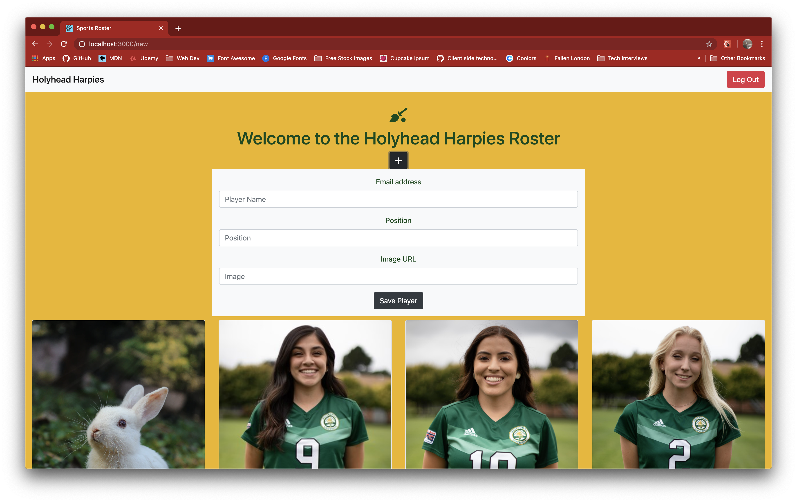

# Sports Roster

### Technologies Used:
HTML5, SCSS/CSS, React, Firebase

### Description:
NSS homework project which introduces React and JSX, and how to perform full CRUD on React components.

“Design single-page web app to manage the roster of a sports team.”

#### Exercise Requirements
- User Authentication with Google login via Firebase
- Firebase Database management
- full CRUD capability for each player on the roster

### Screenshots:
#### Authenticated User's Roster View

#### Add New Player

#### Update Player

#### Instructions:
1. Clone down this repo
2. Install React
3. Create a firebase project and use the apiKeys.example.json file to create the apiKeys file you will need to run this locally
4. Run locally by using the `npm start` command in your terminal.
